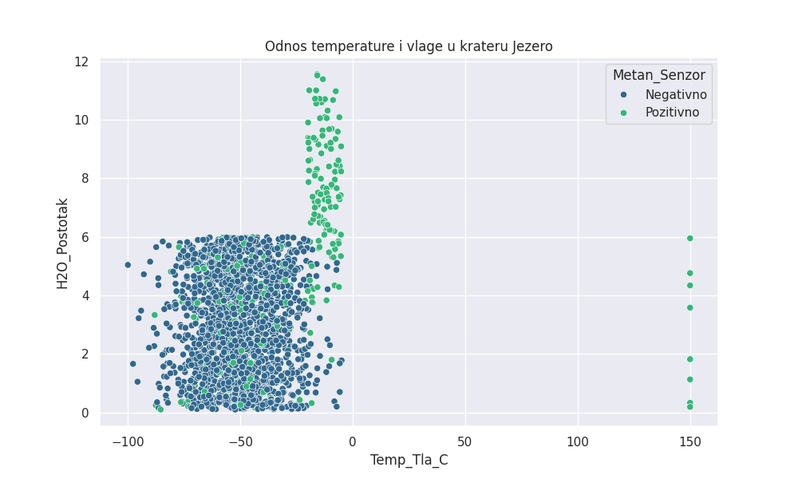
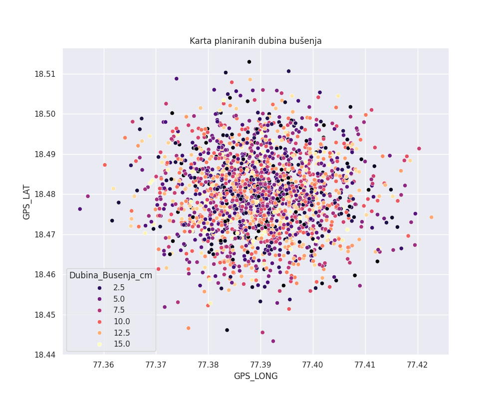
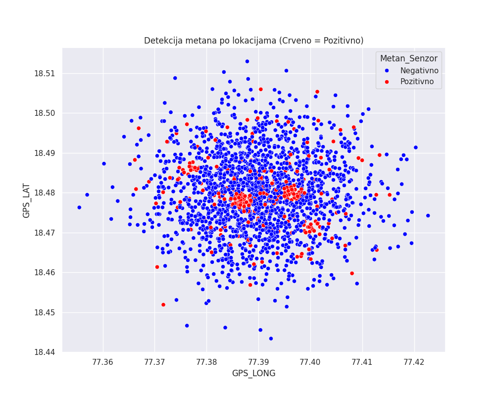
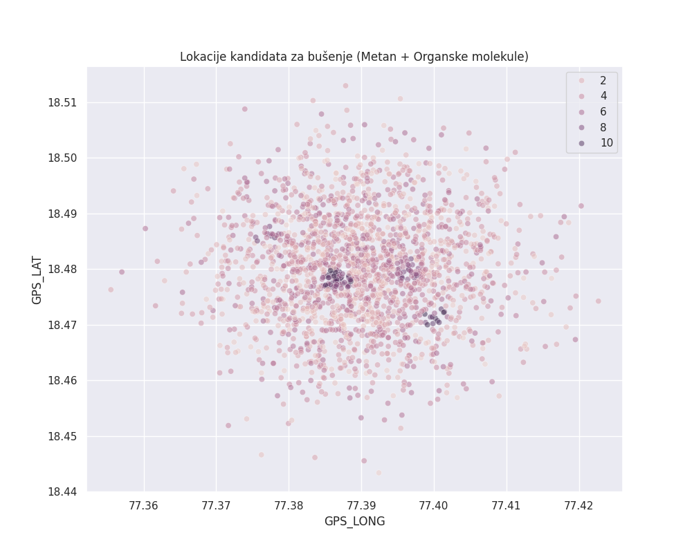
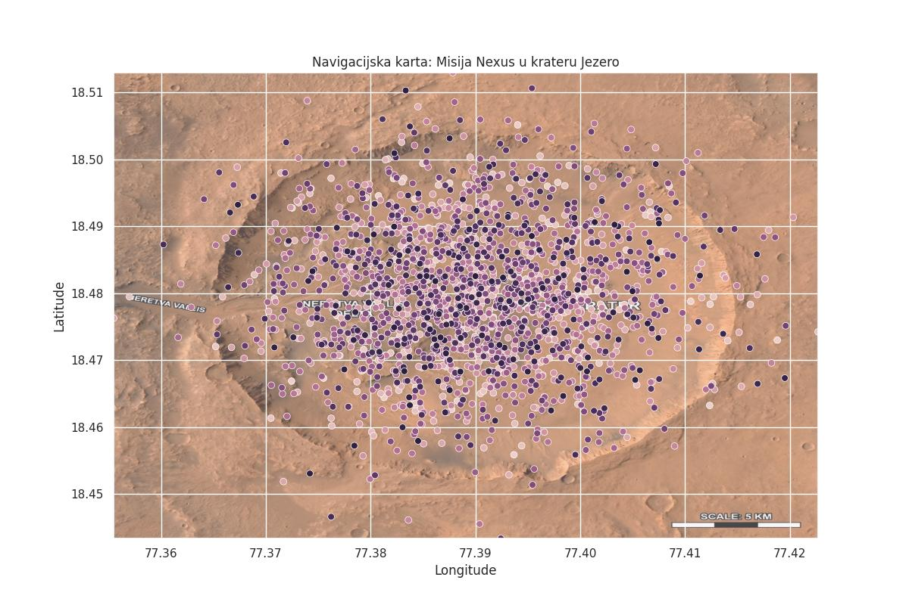

#Projekt nexus

#Opis projekta

1. Sažetak projekta

Ovaj projekt istražuje mogućnost postojanja života na Marsu pomoću analize podataka. 
Sustav automatski obrađuje očitanja sa senzora i identificira lokacije s najvećim znanstvenim potencijalom. 
Program je dizajniran da bude precizan, brz i jednostavan za korištenje u istraživačke svrhe.

2. Metodologija rada

Analiza se temelji na provjeri tri ključna faktora: prisutnosti vode, temperaturi i kemijskom sastavu atmosfere.

Prikupljanje podataka: Simulacija unosa sa senzora.

Obrada: Algoritam uspoređuje podatke sa strogo definiranim biološkim granicama.

Interpretacija: Sustav generira vizualne prikaze radi lakšeg donošenja odluka

3. Analiza i Vizualizacije

Grafikon kretanja temperature: Prikazuje periode kada je život fizički moguć.

Karta vlažnosti tla: Identificira područja s ostacima vode.

Spektar atmosferskih plinova: Detektira prisutnost metana kao ključnog markera.

Usporedba lokacija: Rangiranje mjesta slijetanja prema sigurnosti i potencijalu.

Finalna detekcija života: Sažeti prikaz vjerojatnosti pronalaska mikroorganizama


Evo prikaza podataka koje smo generirali:


1.

2.

3.

4.

5.

Kloniraj repozitorij:
```bash
   git clone MateoJures/Projekt-nexus
   ```
Pokreni glavni program:
[Pritisni ovdje za otvaranje dokumenta](src/zavrsna_simulacija.py)

Popis alata koje sam koristio:

**Jezik** Python 

**HTML** za kostur i sadržaj stranice.

**CSS** za boje, fontove i raspored elemenata.

**Git** za spremanje verzija koda.

Struktura datoteka:

`src/zavrsna_simulacija.py`

`data/mars_uzorci (1).csv`: [Pritisni ovdje za otvaranje dokumenta](data/mars_uzorci.csv)

`data/mars_lokacije (1).csv`: [Pritisni ovdje za otvaranje dokumenta](data/mars_lokacije.csv)

-Mateo Jures - [@MateoJures](https://github.com/MateoJures)
